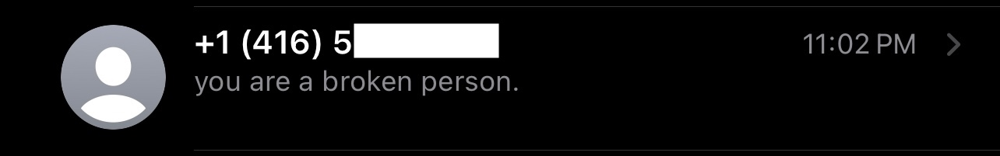

# PhoneInternationaliser

Make sure all of your Contacts' phone numbers are internationally formatted.

## Why?

I'm on vacation to Europe; it's great. Unfortunately, even in Europe I still have to deal with Canadian carriers and their duopoly, meaning they can do cool things like charge [$15/day for roaming](https://www.rogers.com/customer/support/article/roam-like-home-and-roaming-support). When I got to ~$250, I decided it was time to get a prepaid SIM card instead. Unfortunately, this broke a good portion of my contacts from back home.

Every country has its own dialing convention for how phone numbers should be formatted (such as `(647) 123-4567` in [most of North America](https://en.wikipedia.org/wiki/North_American_Numbering_Plan) or `(0)7434 123456` in the U.K.), and a dialing prefix code for calling from other countries (e.g. most of North America's is +1, the U.K.'s is +44, Mexico's is +52, etc.). You don't typically put the international dialing code before numbers unless you have to; you're more likely to use the local convention you're used to. It turns out that when you enter a phone number to the Contacts app by hand on iOS, it stores exactly what you typed – nothing more.

For most users, this will never be a problem. However, iOS derives the prefix to add to these local numbers from the SIM card. So when I inserted a British SIM card into my phone, it started assuming that numbers I entered in Canada, such as `6471234567` should be prefixed with +44, rather than +1. Since `+446471234567` isn't a real number, a huge portion of my contacts broke. (Interestingly, iOS stores the country code if you use the 'Add new contact' functionality in the Messages app, so only about half of my contacts broke: the ones that were entered by hand). I got tired of trying to figure out who was who, so I made this app instead.

It'll go through all of your contacts, figure out which ones don't have any explicit country associated with them, and prepend that country so that it works no matter your SIM card's location. `6471234567` will become `+16471234567`, so iOS doesn't think it's `+446471234567` anymore.

Apple could fix this by implicitly storing the current country code when a new phone number is entered to the contacts app. If I enter a number without a country code while using a Canadian SIM, that's a Canadian number. It should store this alongside the number in case I switch regions in the future. Until then, this app will have to do.

## Getting started

1. Build the Xcode project, running the app
2. Select your country
3. Follow the in-app instructions